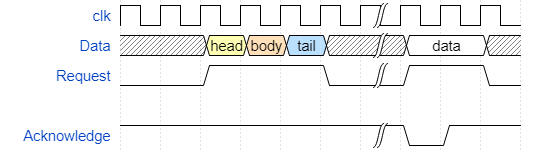

# Wavedrom Plugin for DokuWiki


Add wavedrom charts to Dokuwiki with an intuitive syntax

The charts are generated with https://github.com/drom/wavedrom.

# Syntax

```
<wavedrom>
{ "signal" : [
  { "name": "clk",         "wave": "p.....|..." },
  { "name": "Data",        "wave": "x.345x|=.x", "data": ["head", "body", "tail", "data"] },
  { "name": "Request",     "wave": "0.1..0|1.0" },
  {},
  { "name": "Acknowledge", "wave": "1.....|01." }
]}
</wavedrom>
```

will be rendered to



----
Plugin by Raymond Wu <wusixin@gmail.com>

This program is free software; you can redistribute it and/or modify
it under the terms of the GNU General Public License as published by
the Free Software Foundation; version 2 of the License

This program is distributed in the hope that it will be useful,
but WITHOUT ANY WARRANTY; without even the implied warranty of
MERCHANTABILITY or FITNESS FOR A PARTICULAR PURPOSE.  See the
GNU General Public License for more details.

See the LICENSING file for details
